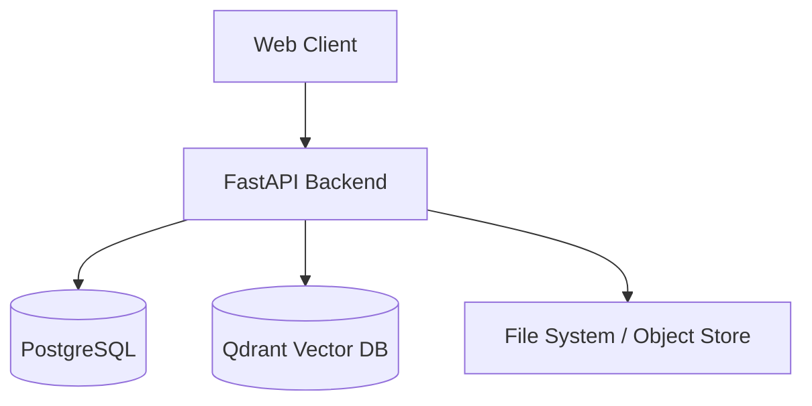

# ResearchMind

AI-powered regulatory intelligence platform

## Description
ResearchMind is a modern backend platform for managing, analyzing, and structuring regulatory documents. It uses PostgreSQL for relational data and Qdrant for vector embeddings, exposing a robust async API via FastAPI.

## Architecture Diagram


## Quick Start
```bash
docker-compose up -d
```

## Development Setup
1. Create a virtual environment using `uv` or `venv` and activate it.
2. Install dependencies: `pip install -e ".[dev]"`
3. Copy `.env.example` to `.env` and adjust settings.
4. Apply migrations: `alembic upgrade head` (Make sure PostgreSQL is running)
5. Start development server: `uvicorn researchmind.api.app:create_app --reload`

## Project Structure
```
researchmind/
├── pyproject.toml
├── docker-compose.yml
└── src/
    └── researchmind/
        ├── api/
        ├── config/
        ├── models/
        └── services/
```

## Tech Stack
| Component | Technology |
|---|---|
| Language | Python 3.12+ |
| Framework | FastAPI |
| Database | PostgreSQL + asyncpg |
| ORM | SQLAlchemy 2.0 |
| Vector DB | Qdrant |
| Migrations | Alembic |
| Schema/Validation | Pydantic v2 |

## License
MIT


