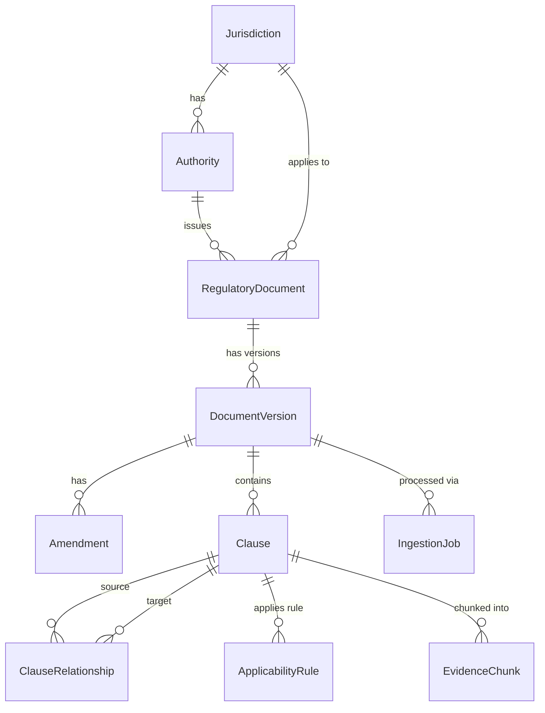

# ResearchMind Architecture

## 1. Overview
ResearchMind is an AI-powered regulatory intelligence platform that understands regulatory documents, their hierarchy, versioning, applicability, and relationships. It is designed to navigate complex legal and regulatory environments dynamically.

## 2. Design Philosophy
Two layers:
1. **Deterministic research infrastructure**: Core data models for documents, metadata, search, retrieval, citations, evidence, and versioning.
2. **Probabilistic intelligence**: LLM, agent, reasoning, planning, and synthesis logic built on top of the deterministic layer. The LLM is never the database; it queries the infrastructure layer.

## 3. Data Model

The system uses 10 primary entities, all utilizing UUID primary keys and standard timestamps.

## 4. Ingestion Pipeline
The 5-stage pipeline for ingesting documents:

1. **Parsing (`DocumentParser`)**: Raw file → pages/blocks with position info (e.g., PyMuPDF).
2. **Structuring (`StructureDetector`)**: Pages/blocks → hierarchical document structure.
3. **Extraction (`ClauseExtractor`)**: Document structure → clause objects ready for storage, utilizing materialized paths.
4. **Relationships (`RelationshipExtractor`)**: Clauses → cross-references and relationships.
5. **Chunking (`ClauseChunker`)**: Clauses → evidence chunks for embedding and indexing.

## 5. Key Design Decisions
- **Regulatory versioning**: Segregation between the abstract document, physical versions (e.g., 2016 Edition), and ongoing amendments.
- **Materialized paths**: Clause hierarchies use materialized paths (e.g., `3.4.2.1`) for efficient tree queries in relational databases.
- **Applicability rules**: Rules decoupled from jurisdictions to support fine-grained conditions like building type, height, etc.
- **Page-level provenance**: Evidence chunks retain metadata mapping directly back to physical pages and bounding boxes for verification.
- **Structured fields vs JSON**: Common properties strictly typed; arbitrary metadata kept in JSON blobs.
- **Knowledge graph**: Built via explicit `ClauseRelationship` objects (e.g., amends, references, supersedes).

## 6. Tech Stack
| Component | Technology |
|---|---|
| Language | Python 3.12+ |
| Web Framework | FastAPI |
| ORM | SQLAlchemy 2.0 |
| Validation | Pydantic v2 |
| RDBMS | PostgreSQL |
| Vector Database | Qdrant |
| PDF Processing | PyMuPDF |
| Testing | Pytest, Asyncio |

## 7. Sprint Roadmap
- **Sprint 0 (Foundation)**: Models, Schema, Basic API, Ingestion Pipeline structure.
- **Sprint 1 (Retrieval)**: Qdrant integration, Chunking strategies, Semantic Search, basic RAG.
- **Sprint 2 (Agent)**: LangGraph/LLM Integration, query planning.
- **Sprint 3+ (Research Intelligence)**: Multi-document synthesis, relationship graphs, UI integration.
